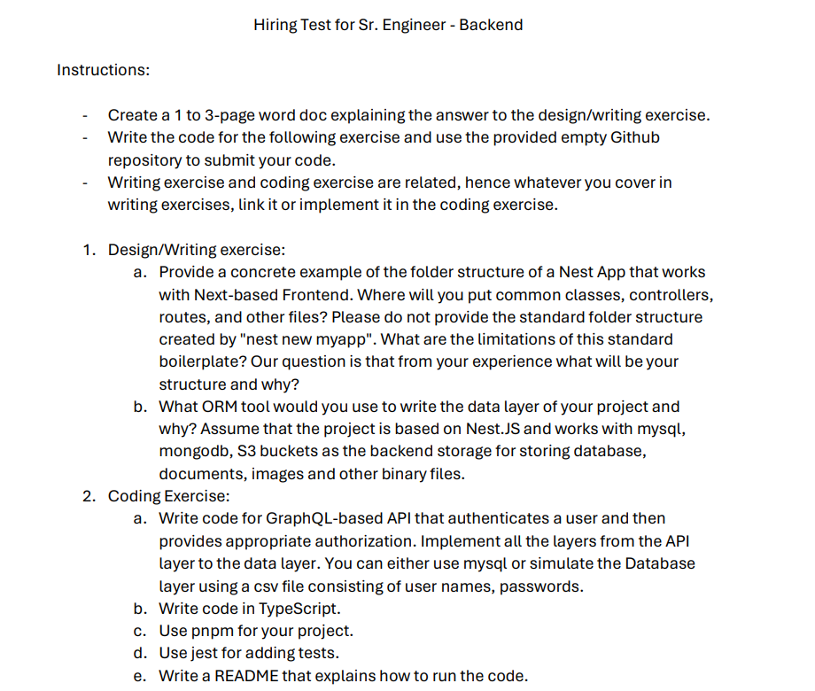

# Coding Test




# Pre-Requisites

In order to run the app, you will need:
```
  Docker-compose
```
# How to Running The App

1. cd into the backend-coding-test
2. Create a .env file to tell Docker the environment variables we need.
3. Set a variable name 'JWT_SECRET_KEY' in the .env file, this should be a 50 character string literal, randomly generated.
5. Do `docker-compose up`

# .env format:
	JWT_SECRET_KEY=<VALUE_FOR_JWT_SECRET_KEY>

# Ready to go:
You can enter http://localhost:3000/graphql, and use the following code snippets to consume the GraphQL API:

```
mutation {
  createUser(username: "testusername", password: "testpassword") {
    username
  }
}
```

```
mutation {
  login(username: "testusername", password: "testpassword") {
    access_token
  }
}
```

```
query {
  getSpecialMessage
}

Remember to put the Authorizadion token you get from the log in mutation:
{
  "Authorization": "Bearer access_token"
}
```

You can also go to http://localhost:5050 and use the credentials (email: admin@admin.com and pass: pgadmin4) to enter the pgAdmin GUI, and see how the user is stored in the database.

# Some Security Considerations:

This project only issues an access token with a long expiration time of 24 hours.
In a production environment, we need to refactor this code to issue a access token with a much shorter expiration time, and use refresh tokens so our users can get a new access token.

There are also some hardcoded values in the Docker Compose, such as the database password. I left them for this proof of concept, but in a real productive environment, they will be securely stored in an environment file. We will never expose that kind of information to ensure the security of our application.

# Running Tests:
Just run `pnpm run tests`

# Design Exercises

# 1) Folder structure:

When running nest new myApp, nest will provide us with a very basic folder structure, like this:

```
  node_modules
  src
    app.controller.ts
    app.module.ts
    app.service.ts
    main.ts
  nest-cli.json
  package.json
  tsconfig.json
  .eslintrc.js
```

Nest is not very opinionated on the way you should structure your project. It's as minimalistic as it gets, consisting of just a simple controller, module, service, and main file. It is very important to organize our code better for various reasons:

  * A structured project layout is crucial for scalability. As the project expands, having a predefined and scalable structure allows for easy integration of new features and components.

  * From maintainability, its easier to maintain, update and extend a project when files are logically organized.
  Future team members can quickly get up to speed on the project.

  * For Collaboration, when multiple team members are working on the same proyect, a consistent folder structure facilitates collaboration.

  * Build tools and scripts can be configured more easily when files are located predictably.

  * As projects grow, navigating through the codebase becomes more difficult. A clear folder structure reduces the time it takes to locate specific files or modules.

<div align="justify">
I will most likely organize folders following the concept of separation of concerns. I will place the controllers file in a 'controllers' folder, where I will handle incoming requests. 

A 'service' folder will contain all the business logic of my application where I can perform some kind of computation on the data or apply any logic to it.

Following that, a 'repository' or data access layer will be created, where I can access the database for any CRUD operations.

We can also include a 'models' folder, it contains the data models or classes that represent the structure of our application's data. In the context of a database, each model may correspond to a table.
Additionally, there can be folders such as 'types/interfaces' to store type definitions and interfaces.

'Utils' folder, to store utility functions or helper modules that provide generic functionality used across different parts of our application.

I also have a folder to hold different tests, from unit testing , to e2e tests, to integration tests.
</div>

# 2) ORM:

<div align="justify">
If my project needs to interact with both a relational and a non-relational database, I would probably use two different tools, like the Sequelize  ORM and Mongoose ODM.

Sequelize is a great tool that supports multiple RDBMS, such as MySQL, PostgreSQL, SQLite, and MSSQL. It provides built-in data validation for data types and constraints, helping ensure that the data being saved to the database meets the defined criteria. It also includes a migration system, allowing us to version-control our database schema. Additionally, it is straightforward to create associations between tables and perform queries. Sequelize also supports hooks and lifecycle events, enabling us to execute custom code at various stages of the ORM operations.

On the other hand, Mongoose lets us define schemas to specify the shape of our data, including data types, default values, and validation rules. It has built-in validation for the data, and we can execute middleware to perform custom logic before or after specific operations. Mongoose also provides a query API, allowing us to construct complex queries.

There is a third option, which is TypeORM, an ORM that supports both relational and non-relational databases. It can be a good option if we are building an MVP, and we have some serious time constraints. This tool can help us develop faster, and team members on our project will only need to learn one tool instead of the two original tools I proposed. The trade-off its that you will increase coupling in the application because you are using the same tool for two different paradigms, so you can lose some flexibility.

I still prefer my original choice to have two different tools, so we can have more flexibility and use solutions that have been developed for each use cases.
</div>